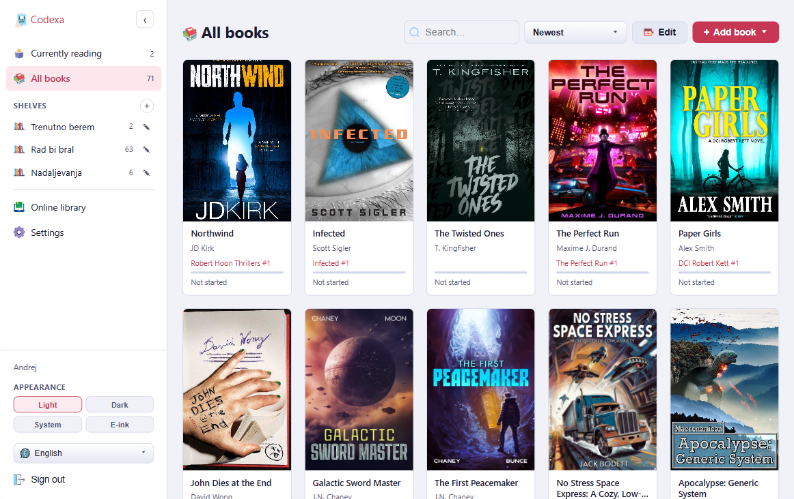
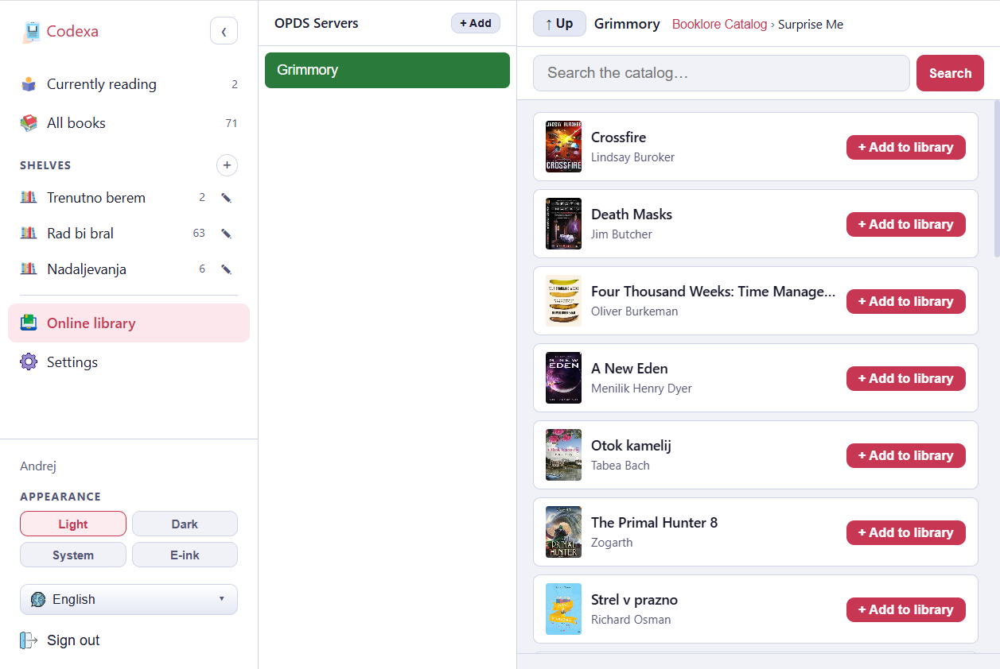
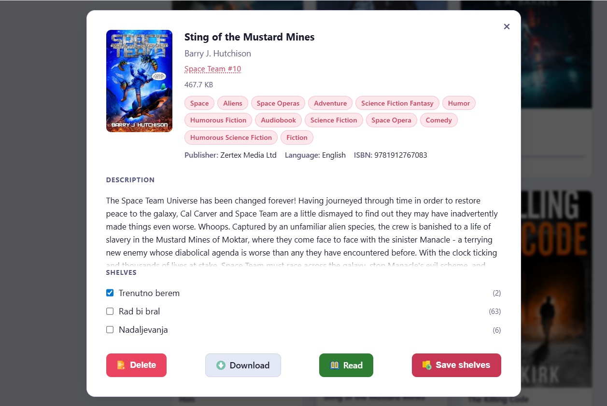
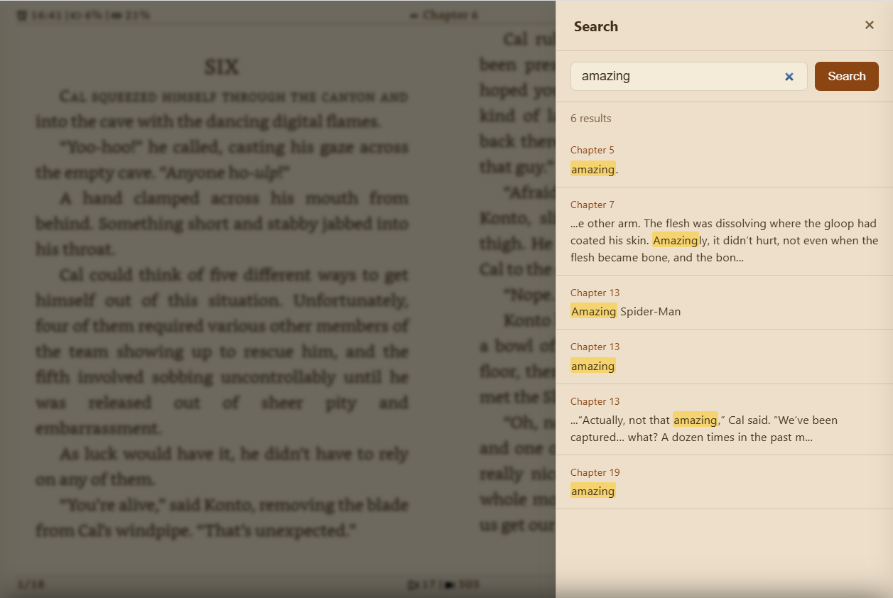
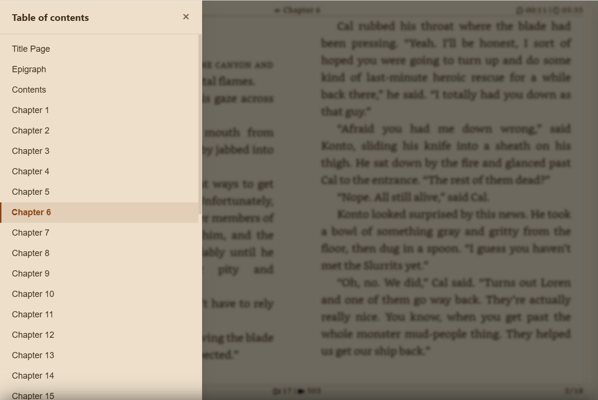
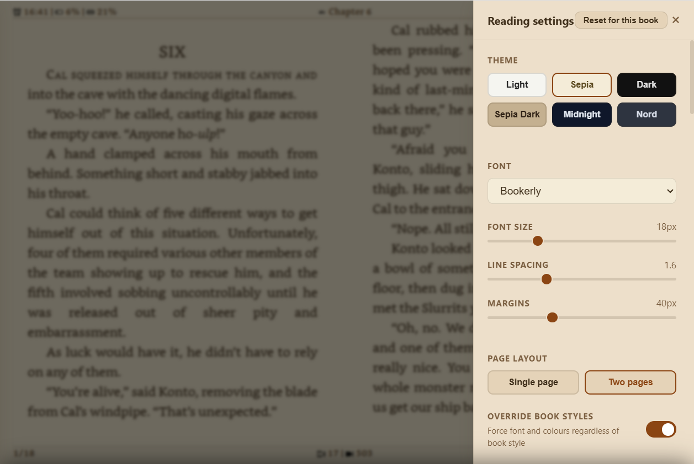

# 📚 Codexa

A self-hosted EPUB web reader with multi-user support, OPDS browsing, KOReader sync, and a built-in dictionary lookup — all in a single lightweight Node.js container.

---

## Screenshots

| Library | OPDS Browser | Book Info |
|:---:|:---:|:---:|
|  |  |  |
| **Reader** | **Dictionary** | **Search** |
|  |  |  |
| **TOC** | **Settings** | **E-Ink** |
|  |  |  |

---

## Features

- **EPUB reader** — powered by epub.js, paginated layout with custom fonts, themes, and status bar
- **Multi-user** — JWT-based authentication, per-user library and reading progress
- **Shelves** — organise books into custom shelves
- **Reading progress** — automatically saved; synced across devices via KOReader
- **KOReader sync** — built-in KOSync-compatible server; also connects to an external KOSync server
- **OPDS browser** — browse and download books from any OPDS catalogue
- **OPDS shelf sync** — bulk-download an entire OPDS folder into a shelf
- **Dictionary lookup** — local StarDict dictionaries (`.ifo/.idx/.dict`)
- **PWA** — installable on desktop and mobile (requires network connection to use)
- **Multilingual UI** — English, Slovenian, German, Spanish, French, Italian, Portuguese
- **Light / Dark / E-ink themes**

---

## Quick Start with Docker

### 1. Copy the sample compose file

```bash
cp docker-compose.sample.yaml docker-compose.yaml
```

### 2. Set a strong JWT secret

```bash
# Generate a secret:
node -e "console.log(require('crypto').randomBytes(64).toString('hex'))"
# …or:
openssl rand -hex 64
```

Paste the output into `docker-compose.yaml` as the value of `JWT_SECRET`.

### 3. Start

```bash
docker compose up -d
```

Codexa is now running at **http://localhost:3000**.  
Register the first account — there is no default admin password.

---

## Configuration

All configuration is via environment variables:

| Variable | Required | Default | Description |
|---|---|---|---|
| `JWT_SECRET` | **yes** | — | Long random string (≥ 64 chars). Changing it invalidates all sessions. |
| `PORT` | no | `3000` | TCP port the server listens on |
| `DATA_DIR` | no | `./data` | Path to persistent data (books, covers, fonts, DB) |
| `CORS_ORIGIN` | no | _(same-origin)_ | Allowed CORS origin, e.g. `https://books.example.com` |

---

## Data Directory Layout

```
data/
├── codexa.db       # SQLite database (WAL mode)
├── books/          # Uploaded EPUB files
├── covers/         # Extracted cover images
├── fonts/          # User-uploaded fonts
└── dictionaries/   # StarDict dictionary files (.ifo / .idx / .dict)
```

Mount this directory as a Docker volume to persist all data across container updates.

---

## Updating

```bash
docker compose pull
docker compose up -d
```

The database schema is migrated automatically on startup.

---

## KOReader Sync Setup

Codexa includes a built-in KOSync-compatible server.

In KOReader:
1. Go to **Tools → KOReader Sync**
2. Set **Custom sync server** to your Codexa URL (e.g. `https://books.example.com`)
3. Log in with the same credentials you use on Codexa

Optionally, you can also connect to an external KOSync server in **Settings → KOReader Sync**.

---

## OPDS

Navigate to **OPDS Browser** in the sidebar.  
Add any OPDS-compatible catalogue (Calibre-Web, Komga, Kavita, Ubooquity, Bookwyrm…) in **Settings → OPDS Servers**.

---

## Dictionary Lookup

Place StarDict dictionary files in `data/dictionaries/`.  
Supported extensions: `.ifo`, `.idx`, `.dict`, `.dict.dz`

Enable and reorder dictionaries in **Reader → Settings → Dictionaries**.

---

## Keyboard Shortcuts

Shortcuts work when focus is not inside a text input.

### Navigation

| Key | Action |
|---|---|
| `→` / `Space` / `Page Down` | Next page |
| `←` / `Page Up` | Previous page |

### Panels

| Key | Action |
|---|---|
| `K` | Open / close Table of Contents |
| `I` | Open / close in-book Search |
| `S` | Open / close Reader Settings |
| `Esc` | Close open panel — or return to Library |

### View

| Key | Action |
|---|---|
| `F` | Toggle fullscreen |

---

## Building from Source

```bash
git clone https://github.com/thehijacker/codexa.git
cd codexa
cp .env.example .env
# Edit .env and set JWT_SECRET
npm install
npm start
```

Requires **Node.js ≥ 18**.

---

## Self-Hosting Behind a Reverse Proxy

Codexa serves plain HTTP. Put it behind **nginx**, **Caddy**, or **Traefik** for HTTPS.

Minimal nginx example:

```nginx
server {
    listen 443 ssl;
    server_name books.example.com;

    location / {
        proxy_pass         http://127.0.0.1:3000;
        proxy_set_header   Host $host;
        proxy_set_header   X-Real-IP $remote_addr;
        client_max_body_size 200M;
    }
}
```

---

## License

[AGPL-3.0](https://www.gnu.org/licenses/agpl-3.0.html) © Andrej Kralj

You are free to use, modify, and self-host this software. If you distribute a modified version (including over a network), you must release the source under the same licence.
