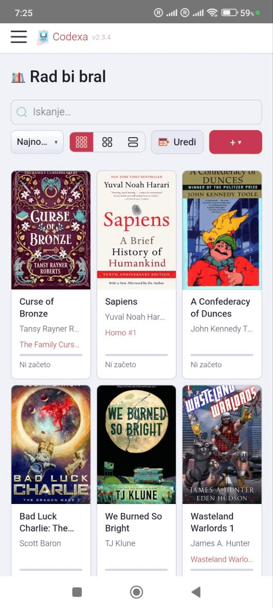
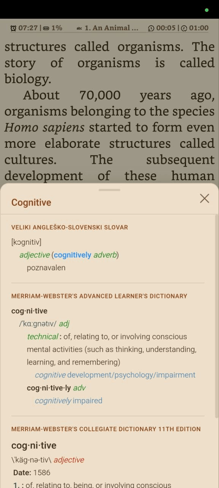

# 📚 Codexa

**Your own private reading platform for EPUB books _and_ comics — self-hosted, offline-capable, and built to sync with your e-reader.**

Codexa is a self-hosted EPUB and comic book reader with multi-user support, full offline reading, OPDS browsing, two-way KOReader sync, and built-in dictionary lookup — all in a single lightweight Node.js container. Read in any browser, install it as a PWA, or use the dedicated Android and iOS apps, and pick up exactly where you left off on any of them.

> 📜 Licensed under **AGPL-3.0** · 🐳 One-container Docker deploy · 🔒 No cloud, no tracking — your books stay on your server.

---

## Why Codexa?

- **🛠️ Its own rendering engine (CXReader).** Codexa doesn't rely on a generic third-party EPUB library. CXReader is purpose-built for reliability, faithful typography, and rock-solid behaviour on slow **e-ink** screens — so awkward real-world EPUBs, fixed-layout manga, and CBZ/CBR comics all render with the same care.
- **📚 Books _and_ comics in one library.** First-class EPUB, fixed-layout EPUB, **CBZ & CBR** — no separate apps.
- **🔄 Real two-way KOReader sync.** A built-in KOSync-compatible server keeps your e-reader and your phone on the same page — no extra software, no cloud.
- **🖥️ Truly works everywhere.** Desktop browsers, mobile PWA, Android APK, and iOS IPA, with a one-tap **Display size** control that scales the UI on everything from phones to big e-ink tablets to desktop monitors.
- **🔌 Plays well with your stack.** Browse and download from any OPDS catalogue (Calibre-Web, Komga, Kavita, Ubooquity…) and sync whole folders into shelves.
- **🏠 Self-hosted and private.** Multi-user, JWT-authenticated, and everything — books, covers, highlights, positions — lives on **your** server.

---

## Screenshots

| Library | OPDS Browser | Book Info |
|:---:|:---:|:---:|
|  |  |  |
| **Reader** | **Dictionary** | **Search** |
|  |  |  |
| **TOC** | **Settings** | **E-Ink** |
|  |  |  |

### Mobile

| Library | Reader | Dictionary | E-Ink |
|:---:|:---:|:---:|:---:|
|  |  |  |  |

---

## Features

### Reading
- **CXReader** — Codexa's own custom-built EPUB engine; replaces epub.js for better reliability and e-ink compatibility
- **CBZ & CBR comic books** — read comic archives directly; two-page spread on desktop; automatic CBR→CBZ conversion; ComicInfo.xml metadata
- **Fixed-layout EPUB** — manga, children's books, and art books rendered at pixel-accurate dimensions via CSS transform scaling
- **Exact position restore** — saves the page number per chapter; reopens on the precise page (not just approximate %)
- **Bookmarks** — add, label, and jump to bookmarks; badge shows bookmark count
- **Highlights & annotations** — highlight in four colours (yellow, green, blue, pink) with optional notes; tap any highlight to edit or delete
- **Search** — full-text search within a book with result navigation and back/accept buttons
- **Dictionary lookup** — double-tap any word; supports multiple local StarDict dictionaries (`.ifo/.idx/.dict`)
- **Footnote popup** — inline footnote and endnote display without leaving the page
- **Bionic reading** — emphasises word prefixes to guide the eye for faster reading
- **Two-page spread** — optional side-by-side layout for wider screens
- **Fullscreen mode** — hides all browser chrome for distraction-free reading
- **Auto-hide toolbar** — header slides away while reading; reappears on hover/tap

### Themes & Display
- **7 reading themes** — Light, Sepia, Dark, Sepia Dark, Midnight, Nord, plus a fully **Custom** theme with free colour picking
- **E-ink mode** — high-contrast black-and-white optimised for e-ink displays
- **Display size** — one-tap UI scaling (Auto / Large / Larger / Largest) that works on phones, tablets, e-ink readers, **and desktop browsers**
- **Custom fonts** — upload `.ttf/.otf/.woff/.woff2` fonts (admin); apply per-book
- **Extensive text settings** — font, size, line height, letter spacing, paragraph indent, paragraph spacing, justification, hyphenation with per-language support
- **Configurable status bar** — up to 6 overlay slots (top/bottom × left/centre/right) showing any combination of: chapter/book page numbers, pages left, progress %, time-to-finish, title, author, chapter, and current time
- **Screen edge padding** — adjustable insets for curved-screen phones and notches

### Sync & Progress
- **Automatic progress saving** — position saved locally and to the server; restored on any device
- **KOReader sync** — built-in KOSync-compatible server; connect KOReader devices with no extra software
- **External KOSync server** — also works with a separate KOSync server; conflict-resolution dialog when positions differ
- **Interrupted session recovery** — banner on next visit offers one-tap resume if the app was closed mid-chapter

### Offline & Mobile
- **Offline reading** — download any book to the device; read without internet
- **PWA** — installable on desktop and mobile; safe-area and notch handling for iOS/Android
- **Android app** — volume-key page navigation, portrait lock, screen-on toggle, hardware e-ink mode toggle
- **iOS app** — sideload or install via TestFlight
- **Responsive layout** — works on phones, tablets, and desktops

### Library
- **Multi-user** — JWT authentication, per-user library and settings
- **Shelves** — organise books into named collections; bulk assign/remove
- **OPDS browser** — browse and download from any OPDS catalogue (Calibre-Web, Komga, Kavita, …)
- **OPDS shelf sync** — bulk-download an entire OPDS folder into a shelf; stale-book detection
- **Reading statistics** — time read, pages turned, sessions, books started/finished, per-book history
- **Series support** — series name, number, and one-click series filter
- **Sort & search** — sort by date, title, author, progress, or series; real-time library search

### Admin
- **User management** — view all users, delete accounts
- **Font management** — upload and delete custom fonts available to all users
- **Dictionary management** — upload StarDict ZIP archives, delete dictionaries
- **Registration control** — enable or disable new-user sign-up

### Internationalisation
- **7 languages** — English, Slovenian, German, Spanish, French, Italian, Portuguese

---

## Quick Start with Docker

### 1. Copy the sample compose file

```bash
cp docker-compose.sample.yaml docker-compose.yaml
```

### 2. Set a strong JWT secret

```bash
# Generate a secret:
node -e "console.log(require('crypto').randomBytes(64).toString('hex'))"
# …or:
openssl rand -hex 64
```

Paste the output into `docker-compose.yaml` as the value of `JWT_SECRET`.

### 3. Start

```bash
docker compose up -d
```

Codexa is now running at **http://localhost:3000**.  
Register the first account — there is no default admin password.

---

## Configuration

All configuration is via environment variables:

| Variable | Required | Default | Description |
|---|---|---|---|
| `JWT_SECRET` | **yes** | — | Long random string (≥ 64 chars). Changing it invalidates all sessions. |
| `PORT` | no | `3000` | TCP port the server listens on |
| `DATA_DIR` | no | `./data` | Path to persistent data (books, covers, fonts, DB) |
| `CORS_ORIGIN` | no | _(same-origin)_ | Allowed CORS origin, e.g. `https://books.example.com` |
| `DEBUG` | no | `false` | Set to `true` to enable verbose browser console logging (all `[reader]`, `[api]`, `[kosync]`, etc. messages). Off by default — only warnings and errors are shown. |

---

## Data Directory Layout

```
data/
├── codexa.db          # SQLite database (WAL mode)
├── books/             # Uploaded EPUB and CBZ files (CBR auto-converted to CBZ)
├── covers/            # Extracted cover images
├── fonts/             # User-uploaded fonts (.ttf/.otf/.woff/.woff2)
└── dictionaries/      # StarDict dictionary files (.ifo / .idx / .dict)
```

Mount this directory as a Docker volume to persist all data across container updates.

---

## Updating

```bash
docker compose pull
docker compose up -d
```

The database schema is migrated automatically on startup.

---

## KOReader Sync Setup

Codexa includes a built-in KOSync-compatible server.

In KOReader:
1. Go to **Tools → KOReader Sync**
2. Set **Custom sync server** to your Codexa URL (e.g. `https://books.example.com`)
3. Log in with the same credentials you use on Codexa

Optionally, you can also connect to an external KOSync server in **Settings → KOReader Sync**.

---

## OPDS

Navigate to **OPDS Browser** in the sidebar.  
Add any OPDS-compatible catalogue (Calibre-Web, Komga, Kavita, Ubooquity, Bookwyrm…) in **Settings → OPDS Servers**.

---

## Dictionary Lookup

Place StarDict dictionary files in `data/dictionaries/`.  
Supported extensions: `.ifo`, `.idx`, `.dict`, `.dict.dz`

Enable and reorder dictionaries in **Reader → Settings → Dictionaries**.

Admins can upload packaged dictionaries (ZIP archives containing the StarDict files) directly from the Settings page.

---

## Offline Reading

Open any book or comic's detail panel and tap **Download for offline reading**. The file is cached by the service worker and will be available even without a network connection. Remove cached books from the same panel, or from the **Downloaded** shelf in the sidebar.

---

## Keyboard Shortcuts

Shortcuts work when focus is not inside a text input.

### Navigation

| Key | Action |
|---|---|
| `→` / `Space` / `Page Down` | Next page |
| `←` / `Page Up` | Previous page |

### Panels

| Key | Action |
|---|---|
| `K` | Open / close Table of Contents |
| `I` | Open / close in-book Search |
| `S` | Open / close Reader Settings |
| `Esc` | Close open panel — or return to Library |

### View

| Key | Action |
|---|---|
| `F` | Toggle fullscreen |

---

## Building from Source

```bash
git clone https://github.com/thehijacker/codexa.git
cd codexa
cp .env.example .env
# Edit .env and set JWT_SECRET
npm install
npm start
```

Requires **Node.js ≥ 18**.

---

## Self-Hosting Behind a Reverse Proxy

Codexa serves plain HTTP. Put it behind **nginx**, **Caddy**, or **Traefik** for HTTPS.

Minimal nginx example:

```nginx
server {
    listen 443 ssl;
    server_name books.example.com;

    location / {
        proxy_pass         http://127.0.0.1:3000;
        proxy_set_header   Host $host;
        proxy_set_header   X-Real-IP $remote_addr;
        client_max_body_size 300M;
    }
}
```

---

## License

[AGPL-3.0](https://www.gnu.org/licenses/agpl-3.0.html) © Andrej Kralj

You are free to use, modify, and self-host this software. If you distribute a modified version (including over a network), you must release the source under the same licence.
